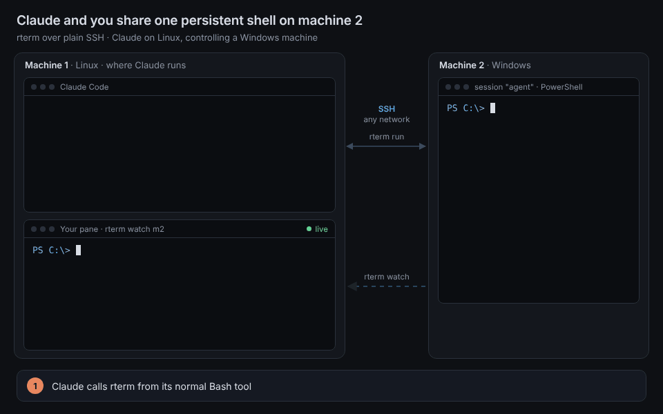
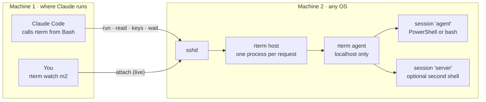
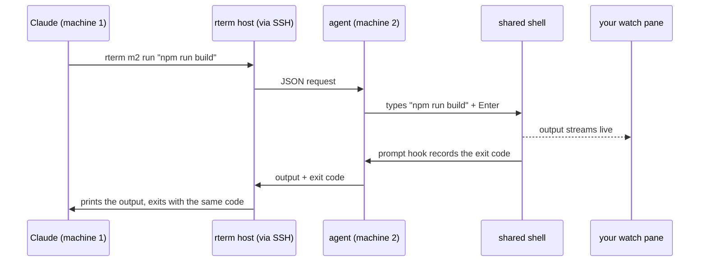

# rterm

A persistent, shared terminal on another machine, for Claude (or any agent) and you at the same time.



Claude runs on machine 1 and calls `rterm m2 run "…"` from its normal Bash tool. The command is typed into a long-lived shell on machine 2, and Claude gets the output and exit code back as if it ran locally. You watch the same shell live with `rterm watch m2`, and you can type into it too.

- One binary for macOS, Linux and Windows, used on both machines.
- Runs over plain SSH, so any network works: LAN, office VPN, Tailscale.
- Not an MCP server, and nothing new listens on the network. Machine 2 only needs its SSH server.
- On Windows, sessions are real PowerShell through ConPTY. No WSL or tmux needed.

## Why not just SSH?

For running commands, plain SSH is enough: `ssh m2 "cmd"` returns the output and exit code. rterm uses SSH underneath, and adds what plain SSH doesn't give an agent:

| | `ssh m2 "cmd"` | `rterm m2 run "cmd"` |
| --- | --- | --- |
| Run a command, get output and exit code | Yes | Yes |
| You can watch the agent work | No. Each call is a hidden channel | Yes, with `rterm watch m2` |
| State carries over (folder, variables, venv, background jobs) | No. Every call starts a fresh shell | Yes. One persistent shell |
| Long-running commands (dev servers, builds) | Blocks until it ends or times out | Returns "still running"; then `wait`, `read` or `keys C-c` |
| Interactive prompts (y/n, passwords) | Hangs | `read` the screen, answer with `keys y Enter` |
| Windows as machine 2 | Works, but no tmux to share or keep a shell | Persistent PowerShell you can attach to |

**When plain SSH is enough:** if you only need the agent to run commands, and don't care about watching it or keeping state between calls.

**On Linux or macOS,** SSH plus tmux plus a small script gets close to rterm. The real gap is Windows, where tmux doesn't run natively, so there's no standard way to get a shared, persistent shell over SSH.

## How it works



Each client command is one SSH call that runs `rterm host` on machine 2. That talks to a small agent on machine 2 (localhost only, token-protected) which owns the shells: a PTY on macOS/Linux, ConPTY on Windows. The agent starts on demand and keeps the shells alive between calls, so it survives SSH drops, VPN reconnects and Claude restarts.

What happens during one `run`:



A hook in the shell's prompt records each command's exit code, which is how the agent knows exactly when a command has finished. Every request is logged to `~/.rterm/log/<session>.jsonl` on machine 2.

## Install

Download the binary for each machine from the [latest release](https://github.com/ninadkale98/remote-terminal/releases/latest).

**Linux / macOS:**

```sh
curl -fL -o rterm https://github.com/ninadkale98/remote-terminal/releases/latest/download/rterm-linux-amd64   # or -linux-arm64, -darwin-arm64, -darwin-amd64
chmod +x rterm && mkdir -p ~/.local/bin && mv rterm ~/.local/bin/
```

**Windows (PowerShell):**

```powershell
Invoke-WebRequest -Uri https://github.com/ninadkale98/remote-terminal/releases/latest/download/rterm-windows-amd64.exe -OutFile $env:USERPROFILE\Downloads\rterm.exe
```

## Set up: machine 2 first, then machine 1

**1. On machine 2** (the one Claude will control). On Windows, use an Administrator PowerShell so it can turn on the OpenSSH server:

```powershell
& $env:USERPROFILE\Downloads\rterm.exe host init
```

This installs rterm to `~/.rterm/bin` and turns on the SSH server (installing it on Windows if needed). It then starts the session agent, checks that the shell works, and prints a pairing line like:

```
rterm add mypc 'CORP\ninad@10.20.4.15' --remote-bin 'C:\Users\ninad\.rterm\bin\rterm.exe'
```

**2. On machine 1** (where Claude runs), paste that line exactly as printed. Enter that account's password once. rterm then sets up a key, an `~/.ssh/config` entry with connection reuse, a Claude Code skill and a note in `~/.claude/CLAUDE.md` so Claude knows how to use it.

**3. Watch** in a terminal split while Claude works:

```sh
rterm watch mypc            # Ctrl-] detaches; --readonly to watch without typing
```

## Commands (machine 1)

| Command | What it does |
| --- | --- |
| `rterm NAME run [--timeout 120] "cmd"` | Types the command into the shared session, waits, prints output, exits with its exit code. If still running at the timeout, returns 124 and the command keeps going. |
| `rterm NAME read [--lines 60]` | Shows the current screen. |
| `rterm NAME keys C-c` · `keys y Enter` · `keys Up` | Sends keystrokes. |
| `rterm NAME wait [--timeout 60] "regex"` | Waits for output from the latest command to match. |
| `rterm NAME:server run "npm run dev"` | Uses a second named terminal. |
| `rterm NAME status` · `kill` | Lists sessions · restarts this session's shell. |
| `rterm watch NAME[:SESSION]` | Watches live. |
| `rterm ls` · `doctor NAME` · `remove NAME` | Lists machines · checks the link · unpairs. |

On machine 2: `rterm host status`, `rterm host stop` / `start`, and `rterm host attach` to watch a session locally.

## Teaching Claude to use it

The manual for AI agents is built into the binary, so it always matches the installed version:

- `rterm guide` prints it, with the machines paired on this computer: persistent sessions, exit codes, long-running commands, prompts, keys, and PowerShell notes.
- `rterm add` installs it as a Claude Code skill at `~/.claude/skills/rterm/SKILL.md`, so Claude loads it whenever you ask for work on another machine. Run `rterm skill` to reinstall it.
- `rterm add` also adds a short section to `~/.claude/CLAUDE.md` naming each machine and its shell, and pointing to `rterm guide`.
- `rterm --help` and `rterm NAME --help` give the short versions.

## Troubleshooting

- **"The system cannot find the file …rterm.exe" during `rterm add`.** Pair as the same Windows account that ran `host init`. The sessions and `rterm.exe` live in that account's profile, so use the user name from the pairing line, not your own.
- **You don't know that account's password** (common on lab machines that log in automatically). Authorize the key from the Windows side instead, in an Administrator prompt there:
  ```
  ssh you@your-linux-host "cat ~/.ssh/rterm_ed25519.pub" | C:\Users\<account>\.rterm\bin\rterm.exe host authorize
  ```
  or paste the key by hand with `rterm.exe host authorize --key "ssh-ed25519 AAAA…"`. Then run `rterm add` again; it won't ask for a password.
- **Installing OpenSSH Server on Windows seems stuck.** It downloads from Windows Update and often takes 5–15 minutes with no progress shown. Check with `Get-WindowsCapability -Online -Name OpenSSH.Server*`. If IT blocks Windows Update, install the `.msi` from [Win32-OpenSSH releases](https://github.com/PowerShell/Win32-OpenSSH/releases) and run `host init` again.
- **Don't use `sudo` with rterm.** It isn't needed, and root often can't read network-mounted home folders, which breaks key and config paths.
- **Anything else:** `rterm doctor NAME` on machine 1, and `~/.rterm/agent.log` on machine 2.

## Notes for v0.1

- Tested end to end on Linux. The Windows host (ConPTY session, PowerShell 7 prompt hook) has been set up and checked on a real Windows machine.
- Windows sessions use PowerShell (pwsh if installed); macOS/Linux sessions use bash.
- One `run` at a time per session; use `NAME:other` for parallel work.
- Unsigned binaries: corporate antivirus may need to allow `rterm.exe`.

## Build

```sh
go build -o rterm ./cmd/rterm   # Go 1.24+; golang.org/x/sys and x/term are vendored in third_party/
go test ./internal/...
```

Releases are built by GitHub Actions when a `v*` tag is pushed or a release is published (`.github/workflows/release.yml`).

The demo animation is a scripted page, `docs/animation/demo.html`, recorded frame by frame with headless Chromium. To regenerate `docs/rterm-demo.gif` after editing it: `python3 docs/animation/record.py` (needs Playwright and ffmpeg).
